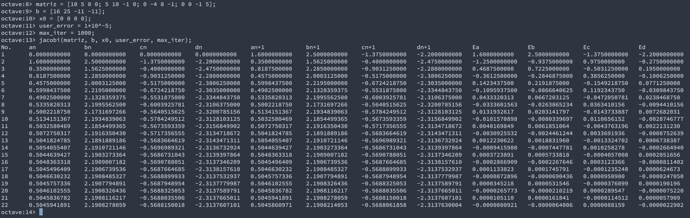
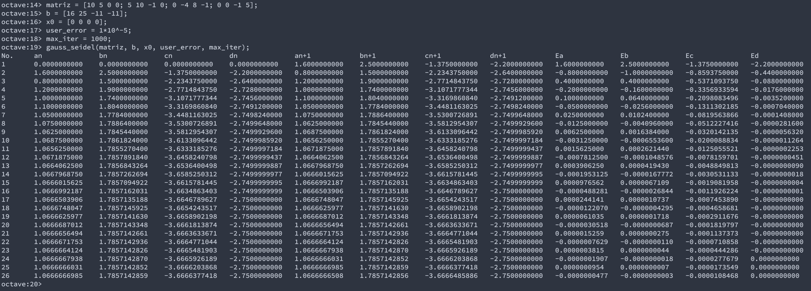

# Método de Jacobi

```{octave eval=FALSE}
% Método de Jacobi
% Este algoritmo funciona sólo con SEL que convergen,
% donde:
%
% matriz es la matriz de coeficientes 
% b es el vector de constantes 
% x0 es el valor inicial de la variables
% user_error es el error o tolerancia 
% max_iter es el límite de iteraciones
%
function jacobi(matriz, b, x0, user_error, max_iter)

  % Se obtiene el tamaño de la matriz
  n = length(b);

  % Se inicializan las variables con el valor ingresado
  x = x0;

  % Se itera hasta alcanzar el máximo de iteraciones
  for i = 1 : max_iter

    % Se itera sobre toda la matriz
    for j = 1 : n

      % Se reemplazan los valores iniciales o anteriores x0 en la matriz
      jacobi_sum = matriz(j, :) * x0(:);
      aux_x = matriz(j, j) * x0(j);

      % Se aplica la definición del Método de Jacobi
      x(j) = b(j) - (jacobi_sum - aux_x);
      x(j) = x(j) / matriz(j, j);

    end

    % Se verifica el error aproximado
    if norm(x - x0) < user_error

      % De ser así, se suspende el ciclo
      break;

    end

    % Se muestran los resultados de cada iteración
    print_row(i, x0, x, (x - x0));

    % Se actualiza el valor de x0 para iteración i + 1
    x0 = x;

  end

end
```

# Método de Gauss-Seidel

```{octave eval=FALSE}
% Método de Gauss Seidel
% Este algoritmo funciona sólo con SEL que convergen,
% donde:
%
% matriz es la matriz de coeficientes 
% b es el vector de constantes 
% x0 es el valor inicial de la variables
% user_error es el error o tolerancia 
% max_iter es el límite de iteraciones
%
function gauss_seidel(matriz, b, x0, user_error, max_iter)

  % Se obtiene el tamaño de la matriz
  n = length(b);

  % Se inicializan las variables con el valor ingresado
  x = x0;

  % Se inicializa la variable que contiene la suma del método
  current_sum = 0;

  % Se itera hasta alcanzar el máximo de iteraciones
  for i = 1 : max_iter

    % Se iterna sobre toda la matriz
    for j = 1 : n

      % Se realiza la sumatoria propuesta por el método Gauss_Seidel

      for k = 1 : j - 1

        current_sum = current_sum + matriz(j, k) * x(j);

      end

      for k = j + 1 : n
        
        current_sum = current_sum + matriz(j, k) * x0(j);
      
      end

      x(j) = (b(j) - current_sum) / matriz(j, j);

      % Se le asigna 0 a la variable para la próxima iteración

      current_sum = 0;

    end

    % Se verifica el error aproximado
    if norm(x - x0) < user_error

      % De ser así, se suspende el ciclo
      break;

    end

    % Se muestran los resultados de cada iteración
    print_row(i, x0, x, (x - x0));

    % Se actualiza el valor de x0 para iteración i + 1
    x0 = x;

  end

end
```

# Método auxiliar para mostrar los valores

```{octave eval=FALSE}
% Esta función muestra los datos en cada iteración
function print_row(i, x, xn, err)
  format_spec = '%u\t%s\t%s\t%s\n';
  array_format = '%.10f\t';
  if i == 1
    head_spec='No.\tan\t\tbn\t\tcn\t\tdn\t\tan+1\t\tbn+1\t\tcn+1\t\tdn+1' ...
              '\t\tEa\t\tEb\t\tEc\t\tEd\n';
    fprintf(head_spec);
  end
  fprintf(format_spec, i, num2str(x, array_format), ...
          num2str(xn, array_format), num2str(err, array_format));
end
```

Dado el siguiente Sistema de Ecuaciones lineales (SEL),

\begin{equation}
\systeme*{10x_1+5x_2=16,5x_1+10x_2-x_3=25,-4x_2+8x_3-x_4=-11,-x_3+5x_4=-11}
\end{equation}

Encontrar una solución aproximada o no, del SEL, utilizando los métodos de:

- Jacobi
- Gauss Seidel

Inicie con las variables en cero e itere hasta obtener un $|Ea|<10^{-5}$. Por
último, compare los errores entre las raíces encontradas por cada uno de los
métodos. 

# Solución

Primero, se convierte el SEL en una matriz de coeficientes y se evalúa la
convergencia su diagonal dominante, así:

\begin{equation}
  \begin{pmatrix}
    10 & 5 & 0 & 0\\
    5 & 10 & -1 & 0\\
    0 & -4 & 8 & -1\\
    0 & 0 & -1 & 5
  \end{pmatrix}
\end{equation}

\begin{gather*}
  |10|\geq|5|+|0|+|0|\Rightarrow10\geq5\\
  |10|\geq|5|+|-1|+|0|\Rightarrow10\geq6\\
  |8|\geq|0|+|-4|+|-1|\Rightarrow8\geq5\\
  |5|\geq|0|+|0|+|-1|\Rightarrow5\geq1
\end{gather*}

Confirmando la convergencia, podemos ingresar el SEL en los scripts expuestos previamente.

*Nota:* Los scripts se escribieron en notación de función, por eso se llaman directamente de la cli de
Octave en este caso.

## Por Jacobi



\pagebreak

## Por Gauss-Seidel




# Conclusión

Después de desarrollar la actividad planteada, me di cuenta que los resultados obtenidos no son los mismos
entre ambos métodos. Según la teoría el método de Gauss-Seidel debería tomar menos iteraciones, por tanto,
no es correcto. Sin embargo, los resultados del método de Jacobi son correctos.
